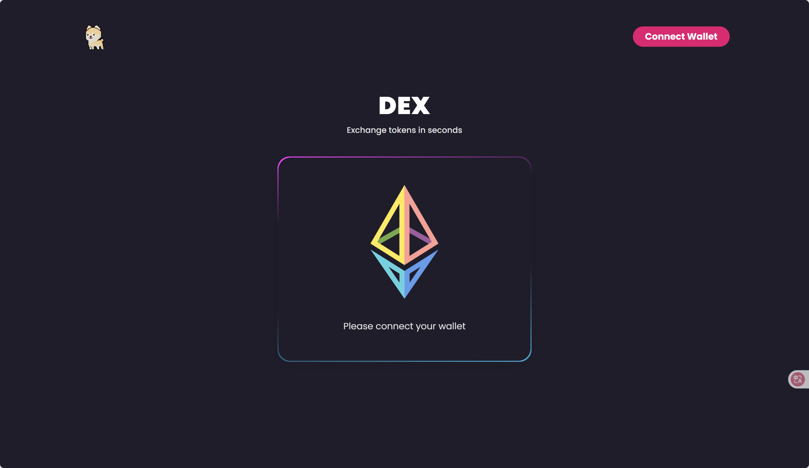
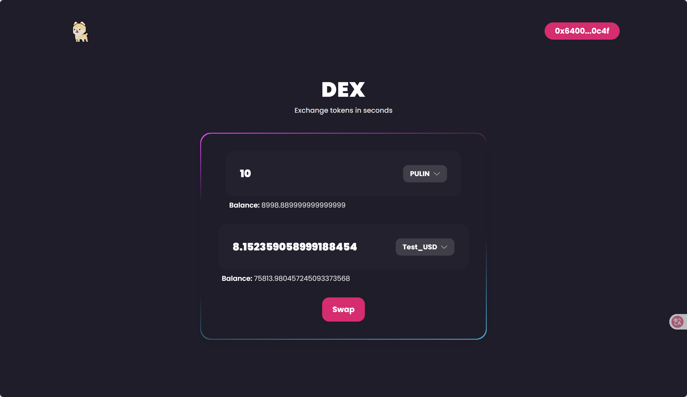

# 🦴 Pulin DEX

A decentralized exchange (DEX) interface built with **React**, **Usedapp**, and **Ethers.js**. Swap tokens seamlessly using an AMM-based backend.




## 🚀 Features

- 🔄 Swap ETH and ERC-20 tokens instantly
- 💼 Connect your wallet via MetaMask
- 📊 View live token balances and allowances
- 🔐 Approve tokens before swapping (if needed)
- 🌓 Dark UI with responsive design

## 🧰 Tech Stack

- **React** – UI framework
- **Ethers.js** – Ethereum interaction
- **Usedapp** – Simplified Web3 hooks
- **Tailwind CSS** – Utility-first styling
- **Solidity (backend)** – AMM smart contracts

## 🔧 Getting Started

```bash
git clone https://github.com/your-username/pulin-dex.git
cd pulin-dex
npm install
npm start


